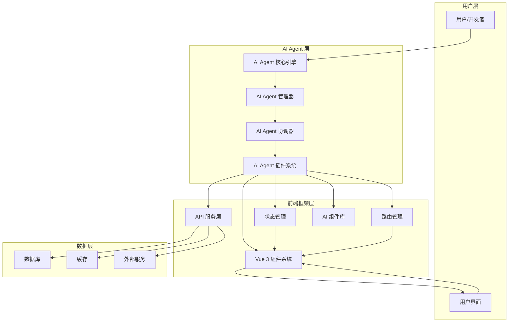
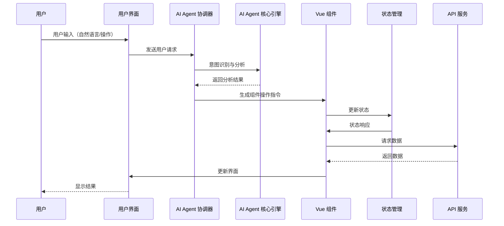

# AI Agent 驱动的前端框架架构设计文档

## 文档概述

本文档详细描述了 Panda Vue Admin 项目中 AI Agent 驱动的前端框架的整体架构、模块划分、数据流和交互方式，特别是 AI Agent 与前端组件的交互机制。

## 1. 架构总览

### 1.1 设计理念

AI Agent 驱动的前端框架旨在将人工智能能力深度集成到前端开发中，实现智能化的组件开发、数据处理、用户体验优化和代码生成。该架构基于以下核心理念：

- **智能化开发**: AI Agent 辅助开发者进行组件设计、代码生成和优化
- **自适应界面**: 根据用户行为和上下文动态调整界面布局和功能
- **智能数据处理**: 自动化的数据获取、清洗、分析和展示
- **自然语言交互**: 支持通过自然语言指令控制前端应用

### 1.2 整体架构图



## 2. 核心模块设计

### 2.1 AI Agent 核心引擎

#### 2.1.1 功能描述
AI Agent 核心引擎是整个框架的大脑，负责处理自然语言理解、意图识别、任务规划和执行调度。

#### 2.1.2 核心功能

**自然语言处理**
- 用户意图识别
- 实体抽取
- 语义理解
- 多轮对话管理

**任务规划与调度**
- 任务分解
- 依赖分析
- 优先级排序
- 资源分配

**知识管理**
- 领域知识库
- 用户偏好学习
- 上下文管理
- 历史记录分析

#### 2.1.3 技术实现

```typescript
interface AIAgentCore {
  // 自然语言处理
  parseIntent(text: string): Promise<Intent>;
  extractEntities(text: string): Promise<Entity[]>;
  understandSemantics(text: string, context: Context): Promise<SemanticResult>;
  
  // 任务管理
  planTask(intent: Intent): Promise<TaskPlan>;
  scheduleTask(plan: TaskPlan): Promise<ScheduledTask>;
  executeTask(task: ScheduledTask): Promise<TaskResult>;
  
  // 知识管理
  updateKnowledge(knowledge: Knowledge): Promise<void>;
  queryKnowledge(query: KnowledgeQuery): Promise<KnowledgeResult>;
}

### 2.2 AI Agent 管理器

#### 2.2.1 功能描述
AI Agent 管理器负责管理多个 AI Agent 的生命周期、配置、权限和资源分配。

#### 2.2.2 核心功能

**Agent 生命周期管理**
- Agent 创建与销毁
- 状态监控
- 健康检查
- 自动重启机制

**配置管理**
- 动态配置更新
- 环境变量管理
- 模型版本控制
- 参数调优

**权限与安全**
- 访问控制
- 敏感信息过滤
- 操作审计
- 安全策略执行

#### 2.2.3 技术实现

```typescript
interface AIAgentManager {
  // 生命周期管理
  createAgent(config: AgentConfig): Promise<Agent>;
  destroyAgent(agentId: string): Promise<void>;
  restartAgent(agentId: string): Promise<void>;
  
  // 配置管理
  updateConfig(agentId: string, config: Partial<AgentConfig>): Promise<void>;
  getConfig(agentId: string): Promise<AgentConfig>;
  
  // 监控与统计
  getAgentStatus(agentId: string): Promise<AgentStatus>;
  getAgentMetrics(agentId: string): Promise<AgentMetrics>;
}

## 3. 数据流设计

### 3.1 数据流架构图



### 3.2 数据流向说明

**请求流向**
1. 用户通过界面输入自然语言指令或执行操作
2. UI 层将请求传递给 AI Agent 协调器
3. AI Agent 核心引擎进行意图识别和语义分析
4. 根据分析结果生成相应的组件操作指令
5. 执行组件更新和数据请求
6. 返回结果给用户界面

**响应流向**
1. 组件更新触发状态变化
2. 状态管理器同步更新相关组件
3. 界面实时响应用户操作
4. AI Agent 持续监听用户反馈
5. 根据反馈优化后续响应

### 3.3 数据缓存策略

**多级缓存设计**
- 浏览器缓存：静态资源缓存
- 内存缓存：会话数据和临时状态
- Service Worker：离线缓存和同步
- CDN 缓存：API 响应缓存

**缓存更新策略**
- 主动更新：定时刷新关键数据
- 被动更新：数据变化时自动更新
- 智能预测：基于用户行为预测数据需求

## 4. AI Agent 与前端组件交互机制

### 4.1 交互模式

#### 4.1.1 自然语言交互
用户通过自然语言与系统进行交互，AI Agent 解析意图并执行相应操作。

```typescript
interface NaturalLanguageInteraction {
  parseUserInput(input: string): Promise<Action>;
  executeAction(action: Action): Promise<Result>;
  generateResponse(result: Result): Promise<string>;
}

// 使用示例
const interaction: NaturalLanguageInteraction = {
  async parseUserInput(input: string) {
    return await aiAgent.parseIntent(input);
  },
  async executeAction(action: Action) {
    return await componentExecutor.execute(action);
  },
  async generateResponse(result: Result) {
    return await responseGenerator.generate(result);
  }
};
```

#### 4.1.2 组件级交互
AI Agent 可以直接操作和创建 Vue 组件，实现动态界面生成。

```typescript
interface ComponentInteraction {
  createComponent(type: string, props: any): Promise<VueComponent>;
  updateComponent(component: VueComponent, props: any): Promise<void>;
  destroyComponent(component: VueComponent): Promise<void>;
}

### 4.2 消息总线设计

**事件驱动架构**
使用发布-订阅模式实现组件间解耦通信。

```typescript
interface MessageBus {
  subscribe(topic: string, handler: MessageHandler): void;
  unsubscribe(topic: string, handler: MessageHandler): void;
  publish(topic: string, message: any): void;
}

// 消息类型定义
type MessageType = 
  | 'user_action'
  | 'agent_response'
  | 'component_update'
  | 'state_change'
  | 'error_notification';

interface Message {
  type: MessageType;
  payload: any;
  timestamp: number;
  source: string;
  target?: string;
}
```

## 5. 实施计划

### 5.1 开发阶段划分

#### 第一阶段：核心引擎实现（2-3周）
- AI Agent 核心引擎基础框架
- 自然语言处理模块
- 任务规划器
- 基础测试用例

#### 第二阶段：组件集成（2-3周）
- Vue 组件 AI 增强接口
- 消息总线实现
- 状态管理 AI 集成
- 组件级交互测试

#### 第三阶段：功能完善（2-3周）
- 高级功能实现
- 性能优化
- 错误处理机制
- 集成测试

#### 第四阶段：部署与验证（1-2周）
- 部署到生产环境
- 性能监控
- 用户反馈收集
- 持续优化

### 5.2 技术栈选择

**前端框架**
- Vue 3 + TypeScript
- Ant Design Vue
- Pinia (状态管理)
- Vue Router

**AI/ML 相关**
- TensorFlow.js
- 自然语言处理库
- 机器学习模型
- 推理引擎

**工具链**
- Vite
- ESLint + Prettier
- Jest + Testing Library
- Git + GitHub Actions

### 5.3 风险评估与缓解

**技术风险**
- AI 模型性能问题
- 前端性能影响
- 复杂度管理

**缓解策略**
- 性能监控与优化
- 渐进式实现
- 充分测试
- 文档完善

## 6. 总结与展望

### 6.1 项目价值

AI Agent 驱动的前端框架将显著提升：
- 开发效率：自动化代码生成和优化
- 用户体验：智能化界面和交互
- 可维护性：清晰的架构和模块化设计
- 扩展性：插件化架构支持

### 6.2 后续规划

**短期目标（3个月内）**
- 完成核心功能实现
- 基础性能优化
- 开发者文档完善

**中期目标（6个月内）**
- 高级功能开发
- 性能深度优化
- 社区建设

**长期目标（1年内）**
- 生态系统完善
- 行业标准制定
- 大规模应用推广

### 6.3 关键成功因素

- 技术实现的可靠性和性能
- 开发者的接受度和使用便利性
- 用户体验的实际提升
- 持续的优化和创新

## 7. 附录

### 7.1 术语表
- **AI Agent**: 人工智能代理，能够自主执行任务的软件实体
- **自然语言处理 (NLP)**: 使计算机理解和处理人类语言的技术
- **意图识别**: 识别用户输入的真实目的
- **实体抽取**: 从文本中提取关键信息单元
- **语义理解**: 理解文本的深层含义

### 7.2 参考资料
- Vue 3 官方文档
- TensorFlow.js 文档
- Ant Design Vue 组件库
- 自然语言处理相关研究论文

### 7.3 联系方式
如有相关问题或建议，请联系项目团队或提交 Issue。

---
**文档版本**: v1.0  
**创建日期**: 2024-01-XX  
**最后更新**: 2024-01-XX  
**文档维护**: Panda Vue Admin 团队
        ES[外部服务]
    end
    
    U --> AIA
    UI --> V
    AIA --> AIM
    AIM --> AIC
    AIC --> AIP
    AIP --> V
    AIP --> S
    AIP --> R
    AIP --> API
    AIP --> A
    V --> UI
    S --> V
    R --> V
    API --> D
    API --> C
    API --> ES
```

## 2. 核心模块设计

### 2.1 AI Agent 核心引擎

#### 2.1.1 功能描述
AI Agent 核心引擎是整个框架的大脑，负责处理自然语言理解、意图识别、任务规划和执行调度。

#### 2.1.2 核心功能

**自然语言处理**
- 用户意图识别
- 实体抽取
- 语义理解
- 多轮对话管理

**任务规划与调度**
- 任务分解
- 依赖分析
- 优先级排序
- 资源分配

**知识管理**
- 领域知识库
- 用户偏好学习
- 上下文管理
- 历史记录分析

#### 2.1.3 技术实现

```typescript
interface AIAgentCore {
  // 自然语言处理
  parseIntent(text: string): Promise<Intent>;
  extractEntities(text: string): Promise<Entity[]>;
  understandSemantics(text: string