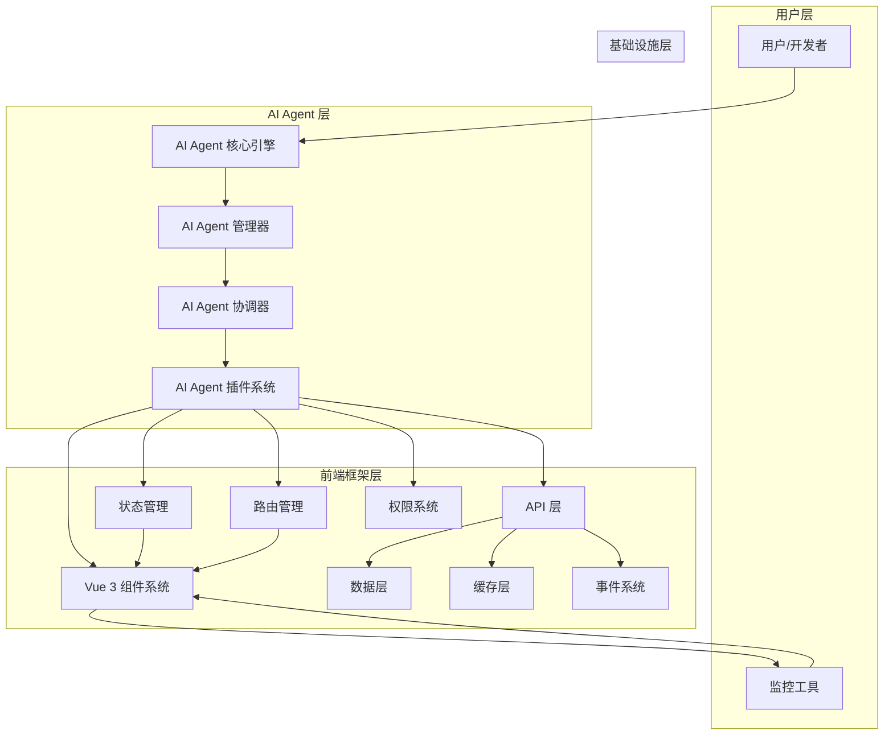
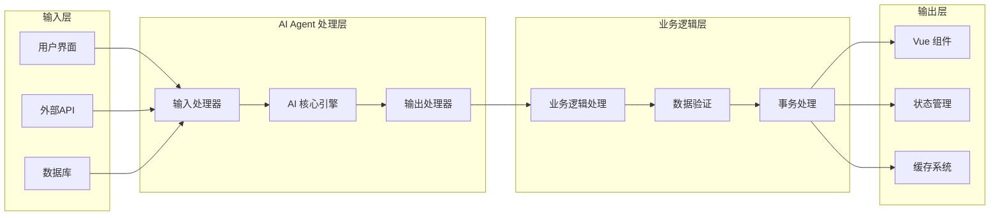

# AI Agent 驱动的前端框架架构设计文档

## 文档概述

本文档详细描述了 Panda Vue Admin 项目中 AI Agent 驱动的前端框架的整体架构、模块划分、数据流和交互方式，特别是 AI Agent 与前端组件的交互机制。

## 1. 架构总览

### 1.1 设计理念

AI Agent 驱动的前端框架旨在将人工智能能力深度集成到前端开发中，实现智能化的组件开发、数据处理、用户体验优化和代码生成。该架构基于以下核心理念：

- **智能化开发**: AI Agent 辅助开发者进行组件设计、代码生成和优化
- **自适应界面**: 根据用户行为和上下文动态调整界面布局和功能
- **智能数据处理**: 自动化的数据获取、清洗、分析和展示
- **自然语言交互**: 支持通过自然语言指令控制前端应用

### 1.2 整体架构图



### 1.3 架构特点

**分层架构设计**
- 清晰的职责分离，便于维护和扩展
- 模块间通过标准化接口通信
- 支持插件化扩展

**智能化集成**
- AI Agent 作为核心组件贯穿各层
- 支持多种AI能力集成
- 智能决策和自动优化

**高性能设计**
- 异步处理机制
- 智能缓存策略
- 资源按需加载

### 1.4 技术栈选择

**前端核心**
- Vue 3 + TypeScript: 现代化前端框架
- Vite: 快速构建工具
- Pinia: 状态管理
- Vue Router: 路由管理

**AI Agent 技术**
- TensorFlow.js: 机器学习模型
- Transformers.js: NLP 处理
- LangChain: AI Agent 框架
- OpenAI API: 大语言模型

**工具链**
- ESLint: 代码规范
- Prettier: 代码格式化
- Vitest: 单元测试
- Playwright: E2E 测试

## 2. 核心模块设计

### 2.1 AI Agent 核心引擎

#### 2.1.1 功能描述
AI Agent 核心引擎是整个框架的大脑，负责处理自然语言理解、意图识别、任务规划和执行调度。

#### 2.1.2 核心功能

**自然语言处理**
- 用户意图识别
- 实体抽取
- 语义理解
- 多轮对话管理

**任务规划与调度**
- 任务分解
- 依赖分析
- 优先级排序
- 资源分配

**知识管理**
- 领域知识库
- 用户偏好学习
- 上下文管理
- 历史记录分析

#### 2.1.3 技术实现

```typescript
interface AIAgentCore {
  // 自然语言处理
  parseIntent(text: string): Promise<Intent>;
  extractEntities(text: string): Promise<Entity[]>;
  understandSemantics(text: string(intent: Intent): Promise<TaskPlan>;
  scheduleTask(plan: TaskPlan): Promise<ScheduledTask>;
  executeTask(task: ScheduledTask): Promise<TaskResult>;
  
  // 知识管理
  updateKnowledge(knowledge: Knowledge): Promise<void>;
  queryKnowledge(query: KnowledgeQuery): Promise<KnowledgeResult>;
  
  // 对话管理
  startConversation(): Promise<Conversation>;
  continueConversation(conversationId: string
}

interface Intent {
  type: string;
  entities: Entity[];
  confidence: number;
  context: Context;
}

interface TaskPlan {
  id: string;
  title: string;
  steps: TaskStep[];
  dependencies: string[];
  priority: number;
  estimatedTime: number;
}

interface TaskStep {
  id: string;
  action: string;
  parameters: Record<string, any>;
  required: boolean;
}

### 2.2 AI Agent 管理器

#### 2.2.1 功能描述
AI Agent 管理器负责管理和协调多个 AI Agent 实例，处理资源分配、负载均衡和性能监控。

#### 2.2.2 核心功能

**Agent 生命周期管理**
- Agent 实例创建和销毁
- Agent 状态监控
- Agent 健康检查
- Agent 资源管理

**负载均衡**
- 任务分发策略
- 资源分配优化
- 性能监控
- 自动扩缩容

**配置管理**
- Agent 配置文件管理
- 环境变量管理
- 权限配置
- 性能调优

#### 2.2.3 技术实现

```typescript
interface AIAgentManager {
  // Agent 管理
  createAgent(config: AgentConfig): Promise<AIAgent>;
  destroyAgent(agentId: string): Promise<void>;
  getAgentStatus(agentId: string): Promise<AgentStatus>;
  
  // 负载均衡
  distributeTask(task: Task): Promise<AgentId>;
  optimizeAllocation(): Promise<void>;
  
  // 配置管理
  updateConfig(agentId: string
}

interface AgentConfig {
  id: string;
  name: string;
  type: AgentType;
  resources: ResourceConfig;
  permissions: Permission[];
  performance: PerformanceConfig;
}

### 2.3 AI Agent 协调器

#### 2.3.1 功能描述
AI Agent 协调器负责处理多个 Agent 之间的协作和通信，确保任务的高效执行和结果的一致性。

#### 2.3.2 核心功能

**协作管理**
- Agent 间通信协议
- 任务协作调度
- 结果聚合
- 冲突解决

**事务管理**
- 分布式事务处理
- 数据一致性保证
- 错误恢复
- 回滚机制

**性能优化**
- 任务并行化
- 资源共享
- 缓存优化
- 负载监控

#### 2.3.3 技术实现

```typescript
interface AIAgentCoordinator {
  // 协作管理
  coordinateAgents(agents: AIAgent[], task: Task): Promise<TaskResult>;
  establishCommunication(agent1: AIAgent, agent2: AIAgent): Promise<void>;
  
  // 事务管理
  startTransaction(): Promise<Transaction>;
  commitTransaction(transactionId: string): Promise<void>;
  rollbackTransaction(transactionId: string): Promise<void>;
  
  // 性能优化
  optimizePerformance(): Promise<void>;
  monitorPerformance(): Promise<PerformanceMetrics>;
}

### 2.4 AI Agent 插件系统

#### 2.4.1 功能描述
AI Agent 插件系统提供扩展机制，允许开发者自定义和扩展 AI Agent 的功能。

#### 2.4.2 核心功能

**插件管理**
- 插件注册和卸载
- 插件依赖管理
- 插件版本控制
- 插件生命周期管理

**功能扩展**
- 自定义任务处理器
- 自定义数据处理器
- 自定义UI组件
- 自定义AI模型

**API 接口**
- 标准化插件接口
- 事件系统接口
- 数据访问接口
- UI交互接口

#### 2.4.3 技术实现

```typescript
interface AIAgentPluginSystem {
  // 插件管理
  registerPlugin(plugin: Plugin): Promise<void>;
  unregisterPlugin(pluginId: string): Promise<void>;
  getPlugin(pluginId: string): Promise<Plugin>;
  listPlugins(): Promise<Plugin[]>;
  
  // 功能扩展
  registerTaskHandler(handler: TaskHandler): Promise<void>;
  registerDataProcessor(processor: DataProcessor): Promise<void>;
  registerUIComponent(component: UIComponent): Promise<void>;
}

interface Plugin {
  id: string;
  name: string;
  version: string;
  dependencies: string[];
  handlers: TaskHandler[];
  processors: DataProcessor[];
  components: UIComponent[];
}

## 3. 数据流设计

### 3.1 整体数据流架构



### 3.2 关键数据流程

#### 3.2.1 用户交互流程
1. 用户通过界面输入指令或操作
2. AI Agent 识别用户意图和上下文
3. 执行相应的任务处理
4. 更新界面状态和数据
5. 向用户展示处理结果

#### 3.2.2 智能化处理流程
1. 接收原始数据输入
2. AI Agent 进行数据分析和理解
3. 制定处理策略和计划
4. 执行智能化的数据转换和处理
5. 输出处理结果并更新状态

### 3.3 状态管理设计

#### 3.3.1 状态分类

**UI 状态**
- 组件状态
- 路由状态
- 主题状态
- 交互状态

**业务状态**
- 数据状态
- 权限状态
- 配置状态
- 会话状态

**AI 状态**
- Agent 状态
- 知识状态
- 对话状态
- 任务状态

#### 3.3.2 状态同步机制

```typescript
interface StateManager {
  // UI 状态管理
  updateUIState(key: string, value: any): Promise<void>;
  getUIState(key: string): Promise<any>;
  
  // AI 状态管理
  updateAIState(key: string, value: any): Promise<void>;
  getAIState(key: string): Promise<any>;
  
  // 状态同步
  syncState(source: StateSource, target: StateTarget): Promise<void>;
  broadcastState(state: State): Promise<void>;
  
  // 状态监听
  onStateChange(key: string, callback: Function): void;
  offStateChange(key: string, callback: Function): void;
}
## 4. AI Agent 与前端组件交互机制

### 4.1 交互模式

#### 4.1.1 声明式交互
通过声明式的方式定义 AI Agent 与组件的交互规则，AI Agent 根据规则自动处理用户交互。

**实现方式：**
- 组件属性中声明 AI Agent 绑定
- 事件处理器中定义 AI Agent 触发条件
- 数据流中定义 AI Agent 处理管道

```vue
<template>
  <div>
    <SmartInput 
      v-model="userInput"
      :ai-agent="dataAgent"
      @ai-response="handleAIResponse"
    />
  </div>
</template>

<script setup>
import { SmartInput } from '@/components/ai'

const userInput = ref('')
const dataAgent = useAIAgent('data-processor')

const handleAIResponse = (response) => {
  console.log('AI Response:', response)
}
</script>
```#### 4.1.2 指令式交互
通过 API 调用的方式直接与 AI Agent 交互，适用于复杂的业务逻辑处理。

**实现方式：**
- AI Agent 服务调用
- 事件驱动交互
- 回调处理机制

```typescript
// AI Agent 服务调用
const aiService = useAIService()

// 发送指令给 AI Agent
const processUserRequest = async (request: UserRequest) => {
  try {
    const response = await aiService.processRequest(request)
    return response
  } catch (error) {
    console.error('AI Service Error:', error)
    throw error
  }
}
```

### 4.2 事件驱动架构

#### 4.2.1 事件系统设计
AI Agent 与前端组件之间通过统一的事件系统进行通信，实现解耦和高效的消息传递。

**核心事件类型：**
- `ai:agent-ready` - AI Agent 准备就绪
- `ai:task-start` - 任务开始
- `ai:task-complete` - 任务完成
- `ai:task-error` - 任务错误
- `ai:state-change` - 状态变更
- `ai:user-input` - 用户输入

```typescript
interface AIEvent {
  type: string;
  payload: any;
  timestamp: number;
  source: string;
  target?: string;
}

class AIEventManager {
  private listeners: Map<string, Function[]> = new Map();
  
  on(event: string, callback: Function): void {
    if (!this.listeners.has(event)) {
      this.listeners.set(event, []);
    }
    this.listeners.get(event)?.push(callback);
  }
  
  emit(event: string, payload: any): void {
    const callbacks = this.listeners.get(event);
    if (callbacks) {
      callbacks.forEach(callback => callback(payload));
    }
  }
}
```### 4.3 组件集成方案

#### 4.3.1 AI 组件封装
为了简化 AI Agent 在前端组件中的使用，我们提供了一系列预封装的 AI 组件。

**核心 AI 组件：**
- `SmartInput` - 智能输入组件
- `AIButton` - AI 驱动按钮
- `SmartForm` - 智能表单
- `AIChat` - AI 聊天组件
- `SmartTable` - 智能表格

```typescript
// SmartInput 组件示例
const SmartInput = defineComponent({
  name: 'SmartInput',
  
  props: {
    modelValue: String,
    aiAgent: Object as PropType<AIAgent>,
    autoProcess: {
      type: Boolean,
      default: false
    }
  },
  
  emits: ['update:modelValue', 'ai-response'],
  
  setup(props, { emit }) {
    const handleInput = async (event: Event) => {
      const value = (event.target as HTMLInputElement).value
      emit('update:modelValue', value)
      
      if (props.autoProcess && props.aiAgent) {
        const response = await props.aiAgent.process(value)
        emit('ai-response', response)
      }
    }
    
    return () => (
      <input 
        value={props.modelValue} 
        onInput={handleInput}
        placeholder="输入内容..."
      />
    )
  }
})
```## 5. 数据流设计

### 5.1 数据流向

```
┌─────────────────┐    ┌─────────────────┐    ┌─────────────────┐
│   用户界面组件   │───►│   AI Agent     │───►│   业务逻辑层    │
└─────────────────┘    └─────────────────┘    └─────────────────┘
         │                       │                       │
         ▼                       ▼                       ▼
┌─────────────────┐    ┌─────────────────┐    ┌─────────────────┐
│   状态管理层     │◄───│   数据处理层     │◄───│   API 服务层     │
└─────────────────┘    └─────────────────┘    └─────────────────┘
```

### 5.2 数据同步机制

#### 5.2.1 双向数据绑定
AI Agent 与前端组件之间建立双向数据绑定，确保数据的一致性和实时性。

**实现方式：**
- 响应式数据流
- 自动同步机制
- 变更检测与更新

```typescript
class DataSyncManager {
  private dataMap: Map<string, any> = new Map()
  private subscribers: Map<string, Function[]> = new Map()
  
  // 设置数据并触发更新
  setData(key: string, value: any): void {
    this.dataMap.set(key, value)
    this.notifySubscribers(key, value)
  }
  
  // 获取数据
  getData(key: string): any {
    return this.dataMap.get(key)
  }
  
  // 订阅数据变更
  subscribe(key: string, callback: Function): void {
    if (!this.subscribers.has(key)) {
      this.subscribers.set(key, [])
    }
    this.subscribers.get(key)?.push(callback)
  }
  
  // 通知订阅者
  private notifySubscribers(key: string, value: any): void {
    const callbacks = this.subscribers.get(key)
    if (callbacks) {
      callbacks.forEach(callback => callback(value))
    }
  }
}
```## 6. 性能优化策略

### 6.1 智能缓存机制
AI Agent 的响应结果需要智能缓存，避免重复计算和网络请求。

**优化策略：**
- 请求结果缓存
- 智能缓存失效
- 本地存储优化

```typescript
class AICacheManager {
  private cache: Map<string, { value: any; timestamp: number }> = new Map()
  private maxAge: number = 5 * 60 * 1000 // 5分钟
  
  async get(key: string, fetchFn: () => Promise<any>): Promise<any> {
    const cached = this.cache.get(key)
    
    // 检查缓存是否存在且未过期
    if (cached && Date.now() - cached.timestamp < this.maxAge) {
      return cached.value
    }
    
    // 获取新数据
    const value = await fetchFn()
    this.cache.set(key, { value, timestamp: Date.now() })
    
    return value
  }
  
  clear(): void {
    this.cache.clear()
  }
}
```

### 6.2 按需加载
AI Agent 组件和功能按需加载，减少初始加载时间。

**实现方式：**
- 动态导入
- 懒加载
- 代码分割

```typescript
// 动态导入 AI Agent
const loadAIAgent = async (agentName: string) => {
  const agent = await import(`@/agents/${agentName}`)
  return agent.default
}

// 组件懒加载
const SmartInput = defineAsyncComponent(() => 
  import('@/components/ai/SmartInput.vue')
)
```

## 7. 测试策略

### 7.1 单元测试
对 AI Agent 和相关组件进行全面的单元测试。

**测试重点：**
- AI Agent 逻辑测试
- 组件交互测试
- 状态管理测试

```typescript
// AI Agent 测试示例
describe('DataProcessorAgent', () => {
  let agent: DataProcessorAgent
  
  beforeEach(() => {
    agent = new DataProcessorAgent()
  })
  
  it('should process user input correctly', async () => {
    const input = '用户查询'
    const result = await agent.process(input)
    
    expect(result).toBeDefined()
    expect(result.success).toBe(true)
  })
  
  it('should handle errors gracefully', async () => {
    const invalidInput = ''
    const result = await agent.process(invalidInput)
    
    expect(result.error).toBeDefined()
  })
})
```

### 7.2 集成测试
测试 AI Agent 与前端组件的集成效果。

**测试场景：**
- 组件与 Agent 的数据流
- 事件响应机制
- 错误处理流程

```typescript
describe('SmartInput with AI Agent', () => {
  it('should trigger AI processing on input', async () => {
    const wrapper = mount(SmartInput, {
      props: {
        modelValue: '',
        aiAgent: mockAgent,
        autoProcess: true
      }
    })
    
    await wrapper.find('input').setValue('test input')
    
    expect(wrapper.emitted('ai-response')).toBeTruthy()
  })
})
```## 8. 实现计划

### 8.1 开发阶段

#### 第一阶段：核心架构搭建（2 周）
- 设计和实现 AI Agent 引擎核心
- 实现基础状态管理系统
- 开发事件驱动架构

#### 第二阶段：组件开发（2 周）
- 实现核心 AI 组件（SmartInput, AIButton, 等）
- 开发组件间通信机制
- 完善组件 API 设计

#### 第三阶段：集成测试（2 周）
- 单元测试和集成测试
- 性能优化
- 文档完善

#### 第四阶段：部署上线（1 周）
- 生产环境部署
- 监控和日志系统
- 问题修复和优化

### 8.2 技术栈选择

#### 前端技术栈
- **Vue 3** - 主框架
- **TypeScript** - 类型安全
- **Vite** - 构建工具
- **Pinia** - 状态管理
- **Vue Router** - 路由管理

#### AI 相关技术
- **AI SDK** - AI 服务接入
- **WebSocket** - 实时通信
- **Web Workers** - 后台处理
- **IndexedDB** - 本地存储

## 9. 总结

### 9.1 架构优势

1. **高度模块化** - 通过模块化设计，各组件职责明确，便于维护和扩展
2. **响应式架构** - AI Agent 能够实时响应用户操作，提供智能交互体验
3. **可扩展性** - 插件化的 AI Agent 系统，支持灵活扩展新的 AI 功能
4. **性能优化** - 智能缓存和按需加载机制，确保应用性能
5. **开发友好** - 提供丰富的组件库和 API，降低开发难度

### 9.2 未来展望

1. **更多 AI 能力集成** - 集成更多先进的 AI 技术，如自然语言处理、计算机视觉等
2. **智能推荐系统** - 基于用户行为分析，提供个性化推荐
3. **自动化测试** - AI 辅助的自动化测试，提高测试效率和准确性
4. **智能运维** - AI 驱动的应用监控和运维，实现智能化的问题诊断和解决

### 9.3 结论

本架构设计为 Vue Admin 应用提供了一个完整的 AI Agent 驱动的解决方案。通过精心设计的架构、模块化的组件系统和智能化的交互机制，能够显著提升应用的用户体验和开发效率。

该架构不仅解决了当前的业务需求，还为未来的技术发展预留了充分的扩展空间。随着 AI 技术的不断进步，这套架构将能够持续演进，为用户提供更加智能和高效的服务。

---

**文档版本：** v1.0  
**最后更新：** 2024-01-15  
**作者：** AI Agent Architecture Team