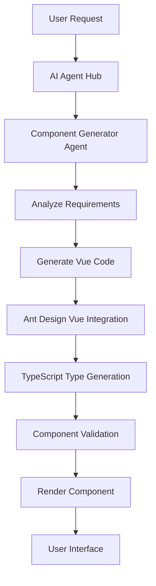
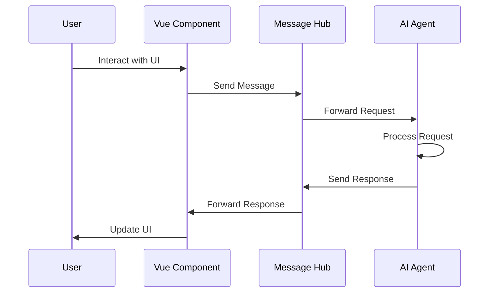

# AI Agent Integration Solution

**Issue**: [hash-panda/panda-vue-admin#43] Step 4: 设计AI Agent集成方案

## 1. Overview

This document outlines the comprehensive AI Agent integration solution for Panda Vue Admin.

## 2. Architecture Overview

### 2.1 Core Components

- AI Agent Hub
- Message Router  
- Task Scheduler
- Component Bridge
- State Synchronizer

### 2.2 Communication Flow

AI Agent <-> Message Hub <-> Vue Component

## 3. Communication Protocols

### 3.1 WebSocket Protocol

Real-time communication for instant agent responses.

**Message Structure:**
```typescript
interface WebSocketMessage {
  id: string;
  type: 'request' | 'response' | 'event' | 'error';
  agent: string;
  action: string;
  payload: any;
  timestamp: number;
  sessionId?: string;
  priority?: 'high' | 'medium' | 'low';
}

interface WebSocketConnection {
  id: string;
  url: string;
  status: 'connecting' | 'connected' | 'disconnected' | 'error';
  reconnectAttempts: number;
  lastActivity: number;
}
```

**Communication Flow:**
1. Client establishes WebSocket connection
2. Authentication and session establishment
3. Message exchange with agents
4. Real-time updates and responses
5. Connection management and error handling

### 3.2 HTTP REST API

Standard API calls for agent integration.

**API Endpoints:**
```typescript
// Agent Management
POST /api/agents/register    // Register new agent
GET  /api/agents            // List all agents
PUT  /api/agents/:id       // Update agent configuration
DELETE /api/agents/:id     // Unregister agent

// Communication
POST /api/agents/:id/execute // Execute agent task
POST /api/agents/:id/query   // Query agent
POST /api/agents/:id/train    // Train agent

// Health & Status
GET  /api/agents/:id/health   // Agent health check
GET  /api/agents/:id/status   // Agent status
GET  /api/agents/:id/metrics  // Agent metrics
```

**Request/Response Format:**
```typescript
interface ApiResponse<T> {
  success: boolean;
  data?: T;
  error?: string;
  timestamp: number;
  requestId: string;
}
```

## 4. Data Structures

### 4.1 Message Format

```typescript
interface AgentMessage {
  id: string;
  type: 'request' | 'response' | 'event' | 'error' | 'notification';
  agent: string;
  action: string;
  payload: any;
  timestamp: number;
  sessionId?: string;
  userId?: string;
  priority?: 'high' | 'medium' | 'low';
  metadata?: Record<string, any>;
}
```

### 4.2 Agent Configuration

```typescript
interface AgentConfig {
  id: string;
  name: string;
  type: 'code-generator' | 'data-analyzer' | 'ui-optimizer' | 'chat-assistant';
  version: string;
  capabilities: string[];
  endpoints: {
    websocket?: string;
    http?: string;
  };
  authentication: {
    type: 'jwt' | 'api-key' | 'oauth';
    credentials: string;
  };
  settings: {
    timeout: number;
    retryAttempts: number;
    maxConcurrentTasks: number;
    loggingLevel: 'debug' | 'info' | 'warn' | 'error';
  };
  status: 'active' | 'inactive' | 'maintenance';
}
```

### 4.3 Task Structure

```typescript
interface AgentTask {
  id: string;
  agentId: string;
  type: string;
  input: any;
  parameters: Record<string, any>;
  priority: 'high' | 'medium' | 'low';
  status: 'pending' | 'running' | 'completed' | 'failed' | 'cancelled';
  progress: number;
  result?: any;
  error?: string;
  createdAt: number;
  startedAt?: number;
  completedAt?: number;
  timeout: number;
  retries: number;
  maxRetries: number;
}
```

### 4.4 Component Generation Data

```typescript
interface ComponentGenerationRequest {
  id: string;
  type: 'form' | 'table' | 'chart' | 'modal' | 'layout' | 'custom';
  description: string;
  requirements: {
    framework: 'vue3';
    uiLibrary: 'ant-design-vue';
    typescript: boolean;
    responsive: boolean;
    accessible: boolean;
  };
  dataSource?: {
    type: 'api' | 'static' | 'state';
    source: string;
    structure: any;
  };
  features: string[];
  styling?: {
    theme?: string;
    customClasses?: string[];
    inlineStyles?: Record<string, string>;
  };
}

interface ComponentGenerationResult {
  id: string;
  code: {
    template: string;
    script: string;
    style: string;
    types: string;
  };
  metadata: {
    componentName: string;
    props: Array<{
      name: string;
      type: string;
      required: boolean;
      defaultValue?: any;
    }>;
    events: Array<{
      name: string;
      parameters: Array<{
        name: string;
        type: string;
      }>;
    }>;
    dependencies: string[];
    compatibility: {
      vue: string;
      antDesignVue: string;
      typescript: string;
    };
  };
  validation: {
    syntax: boolean;
    types: boolean;
    props: boolean;
    events: boolean;
    accessibility: boolean;
    performance: boolean;
  };
}
```

## 5. Integration with Ant Design Vue

### 5.1 Component Mapping

AI agents generate components compatible with Ant Design Vue.

**Component Generation Rules:**
1. **Use Ant Design Vue Components**: All generated code must use official Ant Design Vue components
2. **TypeScript Support**: Full TypeScript support with proper type definitions
3. **Vue 3 Composition API**: Use Vue 3 Composition API with `<script setup>`
4. **Responsive Design**: Components should be responsive using Ant Design's grid system
5. **Theme Integration**: Support for theme customization

**Component Mapping Examples:**
```typescript
// AI Agent generates: Form component
const FormGeneratorAgent = {
  generateForm: async (fields: FieldDefinition[]) => {
    return {
      template: `
        <a-form :model="formState" @finish="onFinish">
          ${fields.map(field => generateFieldComponent(field)).join('')}
          <a-form-item>
            <a-button type="primary" html-type="submit">Submit</a-button>
          </a-form-item>
        </a-form>
      `,
      script: `
        import { reactive } from 'vue';
        import type { FormState } from './types';

        const formState = reactive<FormState>({});
        const onFinish = (values: FormState) => {
          console.log('Form values:', values);
        };
      `
    };
  }
};
```

### 5.2 State Management

Integration with Vue state management (Pinia/Vuex).

**Pinia Store Structure:**
```typescript
// stores/agent.ts
import { defineStore } from 'pinia';

export const useAgentStore = defineStore('agent', {
  state: () => ({
    agents: [] as AgentConfig[],
    tasks: [] as AgentTask[],
    messages: [] as AgentMessage[],
    connection: {
      status: 'disconnected' as ConnectionStatus,
      retryCount: 0,
      lastError: null as string | null
    }
  }),

  getters: {
    activeAgents: (state) => state.agents.filter(agent => agent.status === 'active'),
    pendingTasks: (state) => state.tasks.filter(task => task.status === 'pending'),
    runningTasks: (state) => state.tasks.filter(task => task.status === 'running'),
  },

  actions: {
    async registerAgent(agent: Omit<AgentConfig, 'id'>) {
      const newAgent = { ...agent, id: generateId() };
      this.agents.push(newAgent);
      await this.connectAgent(newAgent);
    },

    async executeTask(task: Omit<AgentTask, 'id'>) {
      const newTask = { ...task, id: generateId() };
      this.tasks.push(newTask);
      
      try {
        newTask.status = 'running';
        const result = await this.callAgentApi(newTask.agentId, 'execute', {
          taskId: newTask.id,
          ...task.parameters
        });
        
        newTask.result = result;
        newTask.status = 'completed';
      } catch (error) {
        newTask.error = error instanceof Error ? error.message : 'Unknown error';
        newTask.status = 'failed';
      }
    }
  }
});
```

### 5.3 Event Integration

**Component Event Handling:**
```typescript
// composables/useAgentEvents.ts
export const useAgentEvents = () => {
  const emit = defineEmits<{
    'agent:response': [response: AgentResponse];
    'agent:error': [error: AgentError];
    'task:progress': [progress: TaskProgress];
  }>();

  const handleAgentResponse = (response: AgentResponse) => {
    emit('agent:response', response);
  };

  const handleAgentError = (error: AgentError) => {
    emit('agent:error', error);
    // Show notification using Ant Design message
    message.error(error.message);
  };

  const handleTaskProgress = (progress: TaskProgress) => {
    emit('task:progress', progress);
    // Update progress using Ant Design progress component
  };

  return {
    handleAgentResponse,
    handleAgentError,
    handleTaskProgress
  };
};
```

## 6. Interaction Flow Diagrams

### 6.1 Component Generation Flow



### 6.2 Real-time Communication Flow



## 7. Implementation Details

### 7.1 Agent Registration

Agents register with the hub for discovery.

**Registration Process:**
```typescript
class AgentHub {
  private agents: Map<string, AgentConfig> = new Map();

  async registerAgent(agentConfig: Omit<AgentConfig, 'id'>): Promise<AgentConfig> {
    const id = generateAgentId();
    const agent: AgentConfig = {
      ...agentConfig,
      id,
      registeredAt: Date.now(),
      status: 'active'
    };
    
    this.agents.set(id, agent);
    
    // Establish connection
    if (agent.endpoints.websocket) {
      await this.connectWebSocket(agent);
    }
    
    // Validate capabilities
    await this.validateAgentCapabilities(agent);
    
    return agent;
  }
  
  private async connectWebSocket(agent: AgentConfig): Promise<void> {
    const ws = new WebSocket(agent.endpoints.websocket);
    
    ws.onopen = () => {
      console.log(`Connected to agent: ${agent.name}`);
      agent.status = 'connected';
    };
    
    ws.onmessage = (event) => {
      const message: WebSocketMessage = JSON.parse(event.data);
      this.handleAgentMessage(agent, message);
    };
    
    ws.onerror = (error) => {
      console.error(`Agent connection error: ${agent.name}`, error);
      agent.status = 'error';
    };
    
    ws.onclose = () => {
      console.log(`Disconnected from agent: ${agent.name}`);
      agent.status = 'disconnected';
    };
  }
}
```

### 7.2 Error Handling and Recovery

**Error Handling Strategy:**
```typescript
class AgentError extends Error {
  constructor(
    public readonly code: string,
    public readonly agentId?: string,
    message: string,
    public readonly details?: any
  ) {
    super(message);
    this.name = 'AgentError';
  }
}

// Error handler with retry logic
class AgentErrorHandler {
  private maxRetries = 3;
  private retryDelay = 1000;

  async withRetry<T>(
    agentId: string,
    operation: () => Promise<T>,
    fallback?: () => Promise<T>
  ): Promise<T> {
    let lastError: Error;
    
    for (let attempt = 1; attempt <= this.maxRetries; attempt++) {
      try {
        return await operation();
      } catch (error) {
        lastError = error instanceof Error ? error : new Error(String(error));
        console.warn(`Agent operation failed (attempt ${attempt}):`, lastError.message);
        
        if (attempt < this.maxRetries) {
          await this.delay(this.retryDelay * attempt);
        }
      }
    }
    
    // Try fallback if available
    if (fallback) {
      try {
        console.log(`Using fallback for agent ${agentId}`);
        return await fallback();
      } catch (fallbackError) {
        console.error('Fallback operation failed:', fallbackError);
      }
    }
    
    throw new AgentError(
      'AGENT_OPERATION_FAILED',
      agentId,
      `Agent operation failed after ${this.maxRetries} attempts`,
      { lastError }
    );
  }

  private delay(ms: number): Promise<void> {
    return new Promise(resolve => setTimeout(resolve, ms));
  }
}
```

### 7.3 Ant Design Vue Compatibility Verification

**Component Compatibility Checker:**
```typescript
interface ComponentCompatibility {
  compatible: boolean;
  warnings: string[];
  suggestions: string[];
  requiredImports: string[];
}

class AntDesignValidator {
  validateGeneratedComponent(code: string): ComponentCompatibility {
    const result: ComponentCompatibility = {
      compatible: true,
      warnings: [],
      suggestions: [],
      requiredImports: []
    };

    // Check for required Ant Design imports
    const antdImports = this.extractAntdImports(code);
    const missingImports = this.getMissingImports(antdImports);
    
    if (missingImports.length > 0) {
      result.requiredImports = missingImports;
      result.warnings.push(`Missing Ant Design imports: ${missingImports.join(', ')}`);
    }

    // Check for common compatibility issues
    const issues = this.checkCommonIssues(code);
    result.warnings.push(...issues.warnings);
    result.suggestions.push(...issues.suggestions);

    // Validate TypeScript usage
    const tsIssues = this.validateTypeScript(code);
    result.warnings.push(...tsIssues.warnings);
    result.suggestions.push(...tsIssues.suggestions);

    result.compatible = result.warnings.length === 0;
    return result;
  }

  private extractAntdImports(code: string): string[] {
    const importRegex = /import\s+{([^}]+)}\s+from\s+['"]antd['"]/g;
    const matches = [];
    let match;
    
    while ((match = importRegex.exec(code)) !== null) {
      const imports = match[1].split(',').map(imp => imp.trim());
      matches.push(...imports);
    }
    
    return matches;
  }

  private getMissingImports(usedImports: string[]): string[] {
    const allAntdImports = [
      'Button', 'Table', 'Form', 'Input', 'Select', 'DatePicker',
      'Modal', 'Drawer', 'Card', 'Space', 'Typography', 'Layout'
    ];
    
    return usedImports.filter(imp => !allAntdImports.includes(imp));
  }

  private checkCommonIssues(code: string): { warnings: string[], suggestions: string[] } {
    const warnings: string[] = [];
    const suggestions: string[] = [];

    // Check for proper reactive usage
    if (code.includes('this.') && !code.includes('setup()')) {
      suggestions.push('Consider using Composition API (setup function) for better TypeScript support');
    }

    // Check for proper TypeScript types
    if (!code.includes(':')) {
      warnings.push('Missing TypeScript type annotations');
      suggestions.push('Add proper type annotations for props, data, and methods');
    }

    // Check for proper v-model usage
    if (code.includes('v-model') && !code.includes(':value')) {
      suggestions.push('Consider using :value and @input for better type safety');
    }

    return { warnings, suggestions };
  }

  private validateTypeScript(code: string): { warnings: string[], suggestions: string[] } {
    const warnings: string[] = [];
    const suggestions: string[] = [];

    // Basic TypeScript validation
    if (code.includes('props: {}')) {
      warnings.push('Untyped props detected');
      suggestions.push('Define proper TypeScript interfaces for props');
    }

    if (code.includes('data() {') && !code.includes('return {') && !code.includes(':')) {
      warnings.push('Untyped data detected');
      suggestions.push('Use TypeScript interfaces or type annotations for data properties');
    }

    return { warnings, suggestions };
  }
}
```