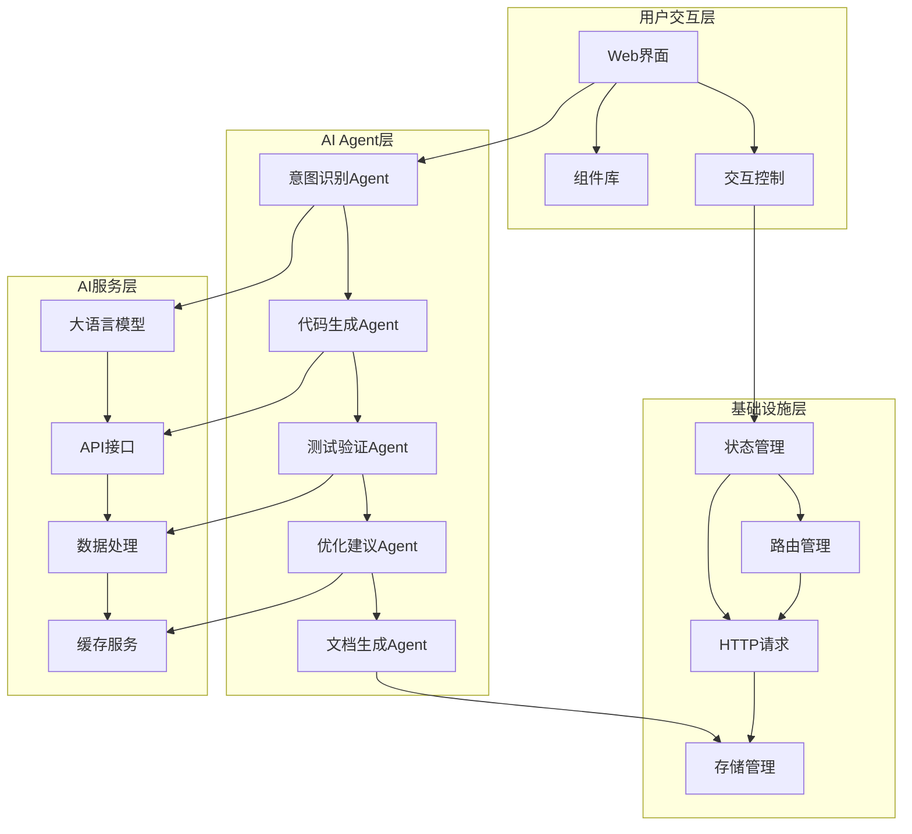

# Panda Vue Admin 技术架构文档

## 1. 整体架构

### 1.1 架构概述

Panda Vue Admin 是一个基于AI Agent驱动的现代化前端管理系统，旨在通过智能化的方式提升开发效率和用户体验。整个架构采用分层设计，确保系统的可扩展性和可维护性。

### 1.2 架构图

## 2. 核心模块

### 2.1 AI Agent核心引擎

#### 2.1.1 Agent调度器
负责管理和协调各个AI Agent的执行顺序和资源分配，提供统一的Agent生命周期管理接口。

**核心功能：**
- Agent注册与发现
- 任务队列管理
- 资源调度与负载均衡
- Agent健康监控
- 错误恢复机制

#### 2.1.2 意图识别Agent
基于自然语言处理技术，理解用户的操作意图和需求描述。

**核心功能：**
- 语义分析
- 意图分类
- 实体抽取
- 上下文理解
- 多轮对话管理

#### 2.1.3 代码生成Agent
根据识别的意图自动生成符合项目规范的代码。

**核心功能：**
- 模板解析
- 代码生成
- 语法检查
- 代码格式化
- 版本兼容性检查

#### 2.1.4 测试验证Agent
自动生成测试用例并验证代码质量。

**核心功能：**
- 单元测试生成
- 集成测试生成
- 性能测试
- 代码覆盖率分析
- 自动化回归测试

#### 2.1.5 优化建议Agent
分析代码并提供性能优化建议。

**核心功能：**
- 代码复杂度分析
- 性能瓶颈识别
- 优化建议生成
- 重构建议
- 最佳实践推荐

#### 2.1.6 文档生成Agent
自动生成项目文档和API文档。

**核心功能：**
- API文档生成
- 组件文档生成
- 技术文档自动更新
- 示例代码生成
- 多语言文档支持

### 2.2 前端框架层

#### 2.2.1 Vue 3 核心框架
采用Vue 3作为前端基础框架，提供响应式数据绑定和组件化开发能力。

**技术特性：**
- Composition API
- 响应式系统
- 组件化开发
- 虚拟DOM
- TypeScript支持

#### 2.2.2 组件库
基于Ant Design Vue构建的组件库体系，支持主题定制和国际化。

**核心组件：**
- 表单组件
- 表格组件
- 导航组件
- 反馈组件
- 数据展示组件

#### 2.2.3 状态管理
使用Pinia进行状态管理，提供模块化的状态管理方案。

**设计原则：**
- 模块化设计
- 类型安全
- 响应式状态
- 开发工具支持
- 持久化能力

#### 2.2.4 路由管理
Vue Router 4，支持动态路由、权限路由和路由守卫。

**核心特性：**
- 动态路由配置
- 权限控制
- 路由懒加载
- 导航守卫
- 路由元信息

### 2.3 基础设施层

#### 2.