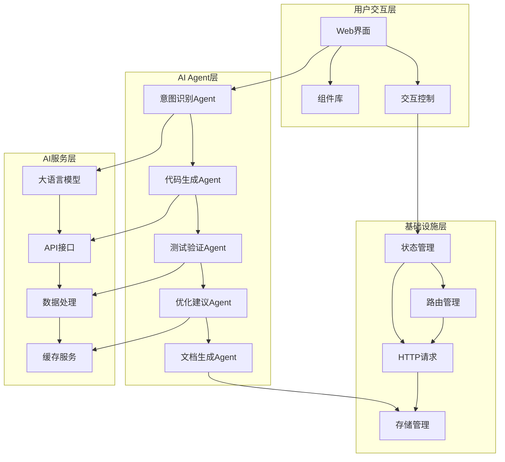
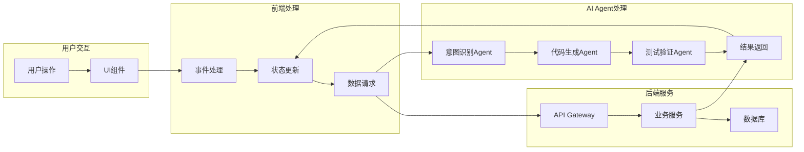
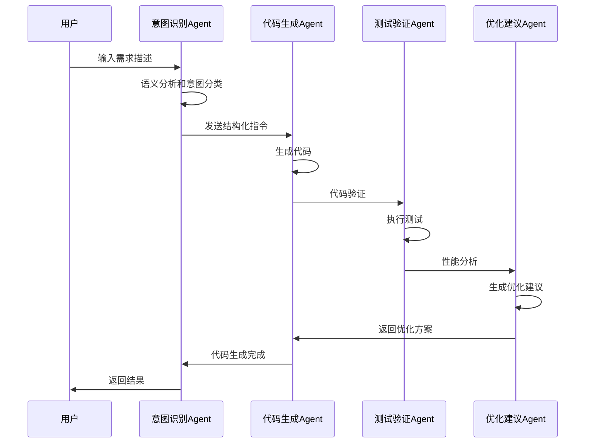
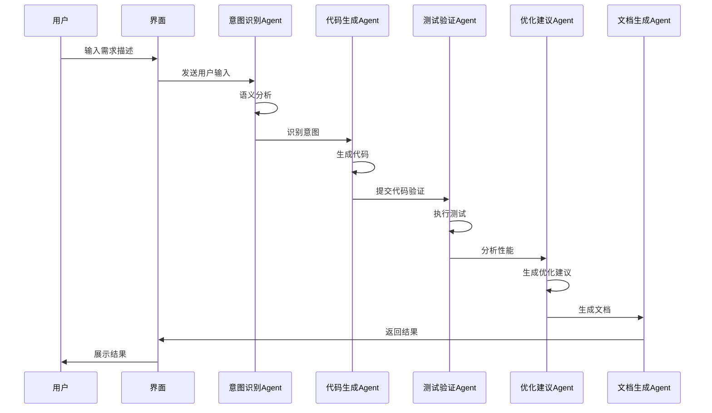
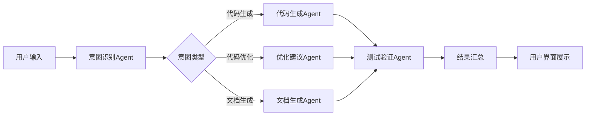
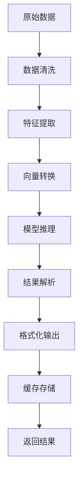

# Panda Vue Admin 技术架构文档

## 1. 整体架构

### 1.1 架构概述

Panda Vue Admin 是一个基于AI Agent驱动的现代化前端管理系统，旨在通过智能化的方式提升开发效率和用户体验。整个架构采用分层设计，确保系统的可扩展性和可维护性。

### 1.2 架构图



## 2. 核心模块

### 2.1 AI Agent核心引擎

#### 2.1.1 Agent调度器
负责管理和协调各个AI Agent的执行顺序和资源分配，提供统一的Agent生命周期管理接口。

**核心功能：**
- Agent注册与发现
- 任务队列管理
- 资源调度与负载均衡
- Agent健康监控
- 错误恢复机制

#### 2.1.2 意图识别Agent
基于自然语言处理技术，理解用户的操作意图和需求描述。

**核心功能：**
- 语义分析
- 意图分类
- 实体抽取
- 上下文理解
- 多轮对话管理

#### 2.1.3 代码生成Agent
根据识别的意图自动生成符合项目规范的代码。

**核心功能：**
- 模板解析
- 代码生成
- 语法检查
- 代码格式化
- 版本兼容性检查

#### 2.1.4 测试验证Agent
自动生成测试用例并验证代码质量。

**核心功能：**
- 单元测试生成
- 集成测试生成
- 性能测试
- 代码覆盖率分析
- 自动化回归测试

#### 2.1.5 优化建议Agent
分析代码并提供性能优化建议。

**核心功能：**
- 代码复杂度分析
- 性能瓶颈识别
- 优化建议生成
- 重构建议
- 最佳实践推荐

#### 2.1.6 文档生成Agent
自动生成项目文档和API文档。

**核心功能：**
- API文档生成
- 组件文档生成
- 技术文档自动更新
- 示例代码生成
- 多语言文档支持

### 2.2 前端框架层

#### 2.2.1 Vue 3 核心框架
采用Vue 3作为前端基础框架，提供响应式数据绑定和组件化开发能力。

**技术特性：**
- Composition API
- 响应式系统
- 组件化开发
- 虚拟DOM
- TypeScript支持

#### 2.2.2 组件库
基于Ant Design Vue构建的组件库体系，支持主题定制和国际化。

**核心组件：**
- 表单组件
- 表格组件
- 导航组件
- 反馈组件
- 数据展示组件

#### 2.2.3 状态管理
使用Pinia进行状态管理，提供模块化的状态管理方案。

**设计原则：**
- 模块化设计
- 类型安全
- 响应式状态
- 开发工具支持
- 持久化能力

#### 2.2.4 路由管理
Vue Router 4，支持动态路由、权限路由和路由守卫。

**核心特性：**
- 动态路由配置
- 权限控制
- 路由懒加载
- 导航守卫
- 路由元信息

### 2.3 基础设施层

#### 2.3.1 HTTP请求层

使用Axios封装的HTTP请求库，支持请求拦截、响应拦截和统一错误处理。

**核心功能：**
- 请求/响应拦截器
- 统一错误处理
- 请求取消
- 请求重试机制
- 请求缓存
- 权限认证集成

#### 2.3.2 存储管理层

提供统一的数据存储管理接口，支持多种存储方式。

**核心功能：**
- 本地存储管理
- 会话存储管理
- 内存缓存
- 持久化存储
- 数据加密

## 3. 技术选型

### 3.1 前端技术栈

#### 3.1.1 核心框架
- **Vue 3.4+**: 采用最新稳定版本，支持Composition API、性能优化和TypeScript
- **TypeScript**: 提供类型安全，提高代码质量和开发效率
- **Vite**: 现代化构建工具，提供快速的开发体验和优化的生产构建

#### 3.1.2 UI组件库
- **Ant Design Vue 4.x**: 成熟的组件库，提供丰富的组件和主题定制能力
- **UnoCSS**: 原子化CSS框架，提供灵活的样式方案
- **Iconify**: 统一的图标解决方案，支持多图标库集成

#### 3.1.3 状态管理与路由
- **Pinia**: 新一代状态管理库，轻量且功能强大
- **Vue Router 4**: 官方路由管理器，支持Composition API集成

#### 3.1.4 AI Agent相关技术
- **OpenAI API**: 大语言模型接口，提供AI能力支持
- **LangChain**: AI应用开发框架，支持Agent chaining
- **Vector Database**: 向量数据库，用于语义搜索和知识管理

### 3.2 开发工具链

#### 3.2.1 代码质量工具
- **ESLint**: 代码规范检查
- **Prettier**: 代码格式化
- **StyleLint**: CSS样式检查
- **Husky**: Git hooks管理
- **Commitlint**: 提交信息规范

#### 3.2.2 测试工具
- **Vitest**: 单元测试框架
- **Testing Library**: 组件测试工具
- **Playwright**: 端到端测试
- **MSW**: Mock Service Worker，API模拟

## 4. 数据流设计

### 4.1 整体数据流图



### 4.2 AI Agent数据流



## 5. 实现方案

### 5.1 AI Agent实现架构

#### 5.1.1 Agent核心框架
采用模块化设计，每个Agent都继承自基础Agent类，提供统一的生命周期管理接口。

```typescript
abstract class BaseAgent {
  abstract async process(input: AgentInput): Promise<AgentOutput>
  abstract async validate(input: AgentInput): Promise<boolean>
  abstract async handleError(error: Error): Promise<AgentOutput>3.1 HTTP请求管理
统一的HTTP请求封装，包括请求拦截、响应处理和错误
处理机制。

**核心功能：**
- 请求拦截器
- 响应拦截器
- 统一错误处理
- Token管理
- 请求重试机制

#### 2.3.2 存储管理
本地存储管理，支持localStorage、sessionStorage和indexedDB。

**核心功能：**
- 统一存储接口
- 数据加密
- 过期时间管理
- 存储空间监控
- 数据迁移支持

#### 2.3.3 工具库
通用工具函数集合，包括数据处理、日期处理、格式化等工具函数。

**核心工具：**
- 数据处理工具
- 日期时间工具
- 字符串处理工具
- 数组操作工具
- 对象操作工具

### 2.4 AI服务层

#### 2.4.1 大语言模型接口
提供与大语言模型的接口封装，支持多种AI模型。

**支持的模型：**
- OpenAI GPT系列
- Claude
- 国内大模型（如文心一言、通义千问等）

#### 2.4.2 API接口管理
统一管理所有AI相关的API接口。

**核心功能：**
- 接口版本管理
- 请求频率限制
- 缓存策略
- 错误监控
- 性能优化

#### 2.4.3 数据处理引擎
处理AI模型输入输出的数据转换和格式化。

**核心功能：**
- 数据预处理
- 结果解析
- 格式转换
- 数据验证
- 结果缓存

## 3. 数据流设计

### 3.1 用户交互数据流



### 3.2 AI Agent协作数据流



### 3.3 数据处理流程



## 4. 技术选型

### 4.1 前端技术栈

| 技术类型 | 选型 | 版本 | 说明 |
|---------|------|------|------|
| 核心框架 | Vue 3 | 3.3+ | 现代化响应式框架 |
| 构建工具 | Vite | 4.0+ | 快速构建工具 |
| 组件库 | Ant Design Vue | 4.0+ | 企业级UI组件 |
| 状态管理 | Pinia | 2.0+ | Vue官方推荐状态管理 |
| 路由 | Vue Router | 4.0+ | 官方路由管理 |
| HTTP客户端 | Axios | 1.0+ | 请求封装 |
| 类型检查 | TypeScript | 5.0+ | 类型安全
| 测试框架 | Vitest | 1.0+ | Vite原生测试框架 |
| 端到端测试 | Cypress/Playwright | 最新 | 自动化测试 |

### 4.2 AI技术栈

| 技术类型 | 选型 | 说明 |
|---------|------|------|
| 大语言模型 | GPT-4/Claude | 主要AI模型 |
| API封装 | 自定义SDK | 统一接口管理 |
| 向量数据库 | Chroma/Pinecone | 语义搜索支持 |
| 意图识别 | 自定义NLP模型 | 自然语言处理 |
| 代码生成 | 模板引擎+LLM | 智能代码生成 |

### 4.3 基础设施技术栈

| 技术类型 | 选型 | 说明 |
|---------|------|------|
| HTTP客户端 | Axios | 请求封装 |
| 存储方案 | LocalStorage+IndexedDB | 本地数据存储 |
| 缓存策略 | 内存缓存+持久化缓存 | 性能优化 |
| 错误监控 | Sentry | 错误追踪 |
| 性能监控 | Lighthouse+Web Vitals | 性能指标 |

## 5. 实现方案

### 5.1 核心模块实现

#### 5.1.1 AI Agent调度器实现

```typescript
// Agent调度器核心接口
interface AgentScheduler {
  register(agent: Agent): void;
  unregister(agentId: string): void;
  schedule(task: Task): Promise<Result>;
  monitor(): AgentStatus[];
  recover(agentId: string): boolean;
