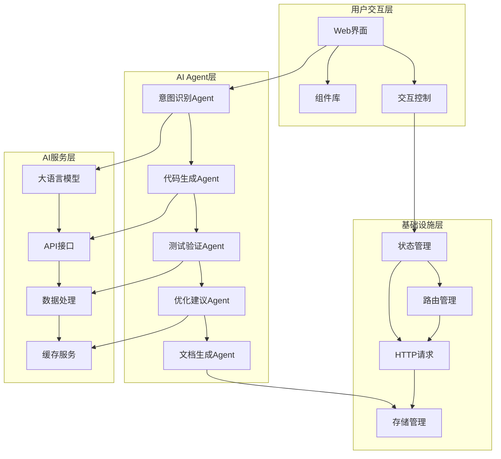
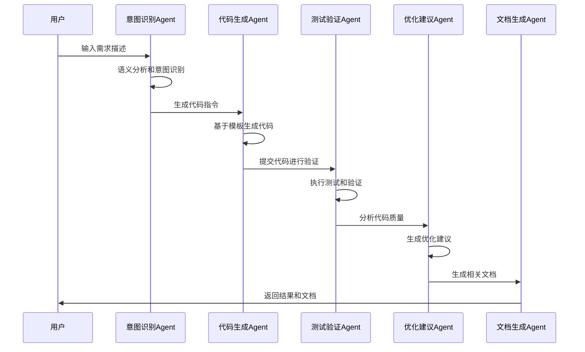
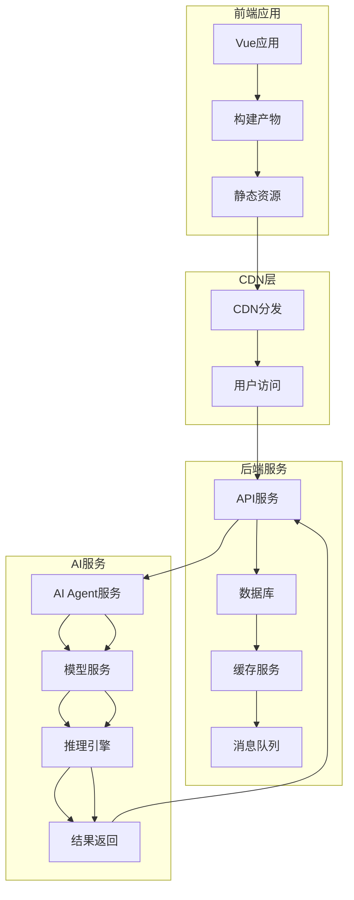
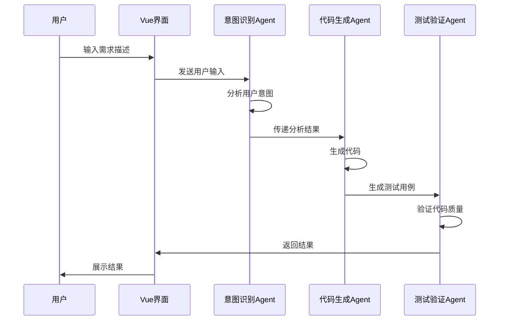
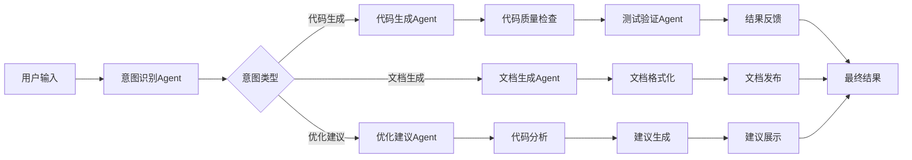
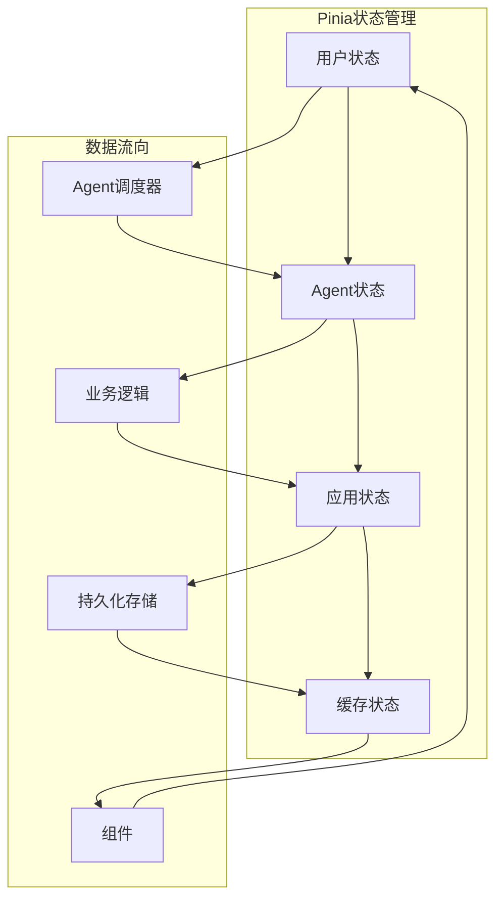

# Panda Vue Admin 技术架构文档

## 1. 整体架构

### 1.1 架构概述

Panda Vue Admin 是一个基于AI Agent驱动的现代化前端管理系统，旨在通过智能化的方式提升开发效率和用户体验。整个架构采用分层设计，确保系统的可扩展性和可维护性。

### 1.2 架构图



## 2. 核心模块

### 2.1 AI Agent核心引擎

#### 2.1.1 Agent调度器
负责管理和协调各个AI Agent的执行顺序和资源分配，提供统一的Agent生命周期管理接口。

**核心功能：**
- Agent注册与发现
- 任务队列管理
- 资源调度与负载均衡
- Agent健康监控
- 错误恢复机制

#### 2.1.2 意图识别Agent
基于自然语言处理技术，理解用户的操作意图和需求描述。

**核心功能：**
- 语义分析
- 意图分类
- 实体抽取
- 上下文理解
- 多轮对话管理

#### 2.1.3 代码生成Agent
根据识别的意图自动生成符合项目规范的代码。

**核心功能：**
- 模板解析
- 代码生成
- 语法检查
- 代码格式化
- 版本兼容性检查

#### 2.1.4 测试验证Agent
自动生成测试用例并验证代码质量。

**核心功能：**
- 单元测试生成
- 集成测试生成
- 性能测试
- 代码覆盖率分析
- 自动化回归测试

#### 2.1.5 优化建议Agent
分析代码并提供性能优化建议。

**核心功能：**
- 代码复杂度分析
- 性能瓶颈识别
- 优化建议生成
- 重构建议
- 最佳实践推荐

#### 2.1.6 文档生成Agent
自动生成项目文档和API文档。

**核心功能：**
- API文档生成
- 组件文档生成
- 技术文档自动更新
- 示例代码生成
- 多语言文档支持

### 2.2 前端框架层

#### 2.2.1 Vue 3 核心框架
采用Vue 3作为前端基础框架，提供响应式数据绑定和组件化开发能力。

**技术特性：**
- Composition API
- 响应式系统
- 组件化开发
- 虚拟DOM
- TypeScript支持

#### 2.2.2 组件库
基于Ant Design Vue构建的组件库体系，支持主题定制和国际化。

**核心组件：**
- 表单组件
- 表格组件
- 导航组件
- 反馈组件
- 数据展示组件

#### 2.2.3 状态管理
使用Pinia进行状态管理，提供模块化的状态管理方案。

**设计原则：**
- 模块化设计
- 类型安全
- 响应式状态
- 开发工具支持
- 持久化能力

#### 2.2.4 路由管理
Vue Router 4，支持动态路由、权限路由和路由守卫。

**核心特性：**
- 动态路由配置
- 权限控制
- 路由懒加载
- 导航守卫
- 路由元信息

### 2.3 基础设施层

#### 2.3.1 HTTP请求层
基于Axios的封装，提供统一的请求拦截、响应处理和错误处理机制。

**核心功能：**
- 请求/响应拦截
- 错误处理
- 请求缓存
- 取消请求
- 超时控制

#### 2.3.2 存储管理
本地存储管理，支持localStorage、sessionStorage和indexedDB。

**存储类型：**
- localStorage
- sessionStorage
- indexedDB
- Cookie
- 内存缓存

#### 2.3.3 工具库
通用工具函数集合，包括数据处理、日期处理、格式化等工具函数。

**工具分类：**
- 数据处理工具
- 日期时间工具
- 格式化工具
- 验证工具
- 加密工具

## 3. 数据流设计

### 3.1 整体数据流



### 3.2 Agent间通信机制

#### 3.2.1 消息队列
基于事件驱动的消息队列系统，支持异步通信和消息持久化。

**核心特性：**
- 发布/订阅模式
- 消息持久化
- 消息重试
- 死信队列
- 消息监控

#### 3.2.2 数据格式标准
统一的数据交换格式，确保Agent间的数据兼容性。

**数据格式：**
- JSON格式
- Protocol Buffers
- 自定义数据结构
- 类型定义
- 验证规则

#### 3.2.3 错误处理机制
完善的错误传播和处理机制，保证系统的稳定性。

**错误处理：**
- 错误分类
- 错误传播
- 错误恢复
- 错误日志
- 错误监控

## 4. 技术选型

### 4.1 前端技术栈

#### 4.1.1 核心框架
- **Vue 3**: 响应式前端框架，提供组合式API
- **TypeScript**: 类型安全的JavaScript超集
- **Vite**: 现代化前端构建工具

#### 4.1.2 UI组件库
- **Ant Design Vue**: 企业级UI组件库
- **VueUse**: Vue组合式API工具集
- **UnoCSS**: 原子化CSS引擎

#### 4.1.3 状态管理
- **Pinia**: Vue 3官方推荐的状态管理库
- **Vueuse/store**: 简化的状态管理方案

#### 4.1.4 路由管理
- **Vue Router 4**: Vue官方路由管理器
- **路由守卫**: 权限控制和路由拦截

### 4.2 AI技术栈

#### 4.2.1 大语言模型
- **OpenAI GPT**: 自然语言理解和生成
- **本地模型**: 支持本地部署的开源模型
- **模型微调**: 针对前端开发的模型优化

#### 4.2.2 自然语言处理
- **自然语言理解**: 意图识别和实体抽取
- **代码理解**: 代码语义分析
- **文本生成**: 文档和注释生成

#### 4.2.3 代码生成
- **AST解析**: 抽象语法树分析
- **模板引擎**: 代码模板渲染
- **代码格式化**: 统一代码风格

### 4.3 开发工具

#### 4.3.1 构建工具
- **Vite**: 快速的构建和开发服务器
- **ESLint**: 代码质量和风格检查
- **Prettier**: 代码格式化
- **Husky**: Git钩子管理

#### 4.3.2 测试工具
- **Vitest**: 单元测试框架
- **Playwright**: E2E测试框架
- **Testing Library**: 测试工具库

#### 4.3.3 部署工具
- **Docker**: 容器化部署
- **GitHub Actions**: CI/CD流程
- **Vercel**: 静态站点部署

## 5. 实现方案

### 5.1 开发流程

#### 5.1.1 需求分析阶段
- 用户需求收集
- 需求分析和整理
- 技术可行性评估
- 项目规划制定

#### 5.1.2 设计阶段
- 系统架构设计
- 数据库设计
- 接口设计
- UI/UX设计

#### 5.1.3 开发阶段
- 环境搭建
- 核心功能开发
- 代码生成和优化
- 测试和调试

#### 5.1.4 部署阶段
- 构建和打包
- 部署配置
- 性能优化
- 监控和日志

### 5.2 AI Agent集成方案

#### 5.2.1 Agent框架选择
采用基于事件的Agent框架，支持模块化和可扩展的架构。

**框架特性：**
- 模块化设计
- 事件驱动
- 插件系统
- 配置化
- 监控和调试

#### 5.2.2 模型集成
支持多种大语言模型的集成，提供统一的接口和抽象。

**集成方式：**
- REST API集成
- WebSocket实时通信
- 本地模型部署
- 模型负载均衡
- 模型缓存

#### 5.2.3 性能优化
针对AI Agent的性能优化，确保系统的高效运行。

**优化策略：**
- 模型缓存
- 请求批处理
- 并发控制
- 资源管理
- 监控和调优

### 5.3 质量保证

#### 5.3.1 代码质量
- 代码规范检查
- 单元测试覆盖
- 集成测试
- 代码审查
- 性能测试

#### 5.3.2 文档质量
- API文档完整性
- 使用说明准确性
- 示例代码质量
- 文档更新维护
- 用户反馈处理

#### 5.3.3 运维质量
- 监控和告警
- 日志收集和分析
- 容错和恢复
- 安全防护
- 性能优化

## 6. 部署架构

### 6.1 系统架构图



### 6.2 部署策略

#### 6.2.1 前端部署
- 静态资源部署到CDN
- 容器化部署
- 蓝绿部署
- 灰度发布
- 版本回滚

#### 6.2.2 后端部署
- 微服务部署
- 容器化编排
- 负载均衡
- 服务发现
- 健康检查

#### 6.2.3 AI服务部署
- GPU资源调度
- 模型服务化
- 模型版本管理
- 资源监控
- 性能优化

## 7. 监控与维护

### 7.1 监控体系

#### 7.1.1 性能监控
- 页面加载性能
- API响应时间
- 资源加载情况
- 内存使用情况
- CPU使用率

#### 7.1.2 错误监控
- 前端错误捕获
- API错误监控
- AI Agent错误监控
- 系统级错误监控
- 错误统计分析

#### 7.1.3 业务监控
- 用户行为分析
- 功能使用统计
- 业务指标监控
- 转化率分析
- 用户反馈收集

### 7.2 维护策略

#### 7.2.1 日常维护
- 系统巡检
- 日志分析
- 性能优化
- 安全更新
- 备份恢复

#### 7.2.2 版本管理
- 版本发布管理
- 回滚机制
- 兼容性测试
- 功能验证
- 性能测试

#### 7.2.3 应急响应
- 故障快速响应
- 问题定位分析
- 临时解决方案
- 根本原因分析
- 长期改进措施

## 8. 总结与展望

### 8.1 技术优势

#### 8.1.1 创新性
- AI Agent驱动的开发模式
- 智能化的代码生成
- 自动化的测试和优化
- 智能化的文档生成

#### 8.1.2 高效性
- 提升开发效率
- 减少重复工作
- 自动化流程
- 快速迭代

#### 8.1.3 可扩展性
- 模块化设计
- 插件化架构
- 微服务支持
- 容器化部署

### 8.2 发展规划

#### 8.2.1 短期目标
- 完善核心功能
- 提升代码质量
- 优化用户体验
- 增强稳定性

#### 8.2.2 中期目标
- 扩展Agent能力
- 支持更多框架
- 集成更多服务
- 建立生态体系

#### 8.2.3 长期愿景
- 构建完整的AI开发平台
- 支持全栈开发
- 建立开发者社区
- 推动行业发展

---

*本文档基于当前技术发展趋势和项目需求制定，将根据实际开发情况进行调整和完善。*.1 监控体系

#### 7
拦截、响应处理和错误处理机制。

**核心功能：**
- 请求拦截器
- 响应拦截器
- 统一错误处理
- Token管理
- 请求重试机制

#### 2.3.2 存储管理
本地存储管理，支持localStorage、sessionStorage和indexedDB。

**核心功能：**
- 统一存储接口
- 数据加密
- 过期时间管理
- 存储空间监控
- 数据迁移支持

#### 2.3.3 工具库
通用工具函数集合，包括数据处理、日期处理、格式化等工具函数。

**核心工具：**
- 数据处理工具
- 日期时间工具
- 字符串处理工具
- 数组操作工具
- 对象操作工具

### 2.4 AI服务层

#### 2.4.1 大语言模型接口
提供与大语言模型的接口封装，支持多种AI模型。

**支持的模型：**
- OpenAI GPT系列
- Claude
- 国内大模型（如文心一言、通义千问等）

#### 2.4.2 API接口管理
统一管理所有AI相关的API接口。

**核心功能：**
- 接口版本管理
- 请求频率限制
- 缓存策略
- 错误监控
- 性能优化

#### 2.4.3 数据处理引擎
处理AI模型输入输出的数据转换和格式化。

**核心功能：**
- 数据预处理
- 结果解析
- 格式转换
- 数据验证
- 结果缓存

## 3. 数据流设计

### 3.1 用户交互数据流



### 3.2 AI Agent间数据流



### 3.3 状态管理数据流



## 4. 技术选型

### 4.1 前端技术栈

| 技术类型 | 选型 | 版本 | 说明 |
|---------|------|------|------|
| 核心框架 | Vue 3 | 3.3+ | 现代化响应式框架 |
| 构建工具 | Vite | 4.0+ | 快速构建工具 |
| 组件库 | Ant Design Vue | 4.0+ | 企业级组件库 |
| 状态管理 | Pinia | 2.0+ | Vue官方推荐状态管理 |
| 路由 | Vue Router | 4.0+ | 官方路由管理 |
| 类型系统 | TypeScript | 5.0+ | 类型安全支持 |
| 样式方案 | Less/SCSS | 最新 | CSS预
处理器 |
| 单元测试 | Vitest | 1.0+ | Vite原生测试框架 |
| 端到端测试 | Cypress/Playwright | 最新 | 自动化测试 |

### 4.2 AI技术栈

| 技术类型 | 选型 | 说明 |
|---------|------|------|
| 大语言模型 | GPT-4/Claude | 主要AI模型 |
| API封装 | 自定义SDK | 统一接口管理 |
| 向量数据库 | Chroma/Pinecone | 语义搜索支持 |
| 意图识别 | 自定义NLP模型 | 自然语言处理 |
| 代码生成 | 模板引擎+LLM | 智能代码生成 |

### 4.3 基础设施技术栈

| 技术类型 | 选型 | 说明 |
|---------|------|------|
| HTTP客户端 | Axios | 请求封装 |
| 存储方案 | LocalStorage+IndexedDB | 本地数据存储 |
| 缓存策略 | 内存缓存+持久化缓存 | 性能优化 |
| 错误监控 | Sentry | 错误追踪 |
| 性能监控 | Lighthouse+Web Vitals | 性能指标 |

## 5. 实现方案

### 5.1 核心模块实现

#### 5.1.1 AI Agent调度器实现

```typescript
// Agent调度器核心接口
interface AgentScheduler {
  register(agent: Agent): void;
  unregister(agentId: string): void;
  schedule(task: Task): Promise<Result>;
  monitor(): AgentStatus[];
  recover(agentId: string): boolean;
}

// Agent调度器实现
class AgentSchedulerImpl implements AgentScheduler {
  private agents: Map<string, Agent> = new Map();
  private taskQueue: Task[] = [];
  
  async schedule(task: Task): Promise<Result> {
    const agent = this.selectAgent(task);
    return await agent.execute(task);
  }
}
```

#### 5.1.2 前端集成实现

AI Agent能力通过Vue Composition API集成到组件中：

```typescript
// AI Agent Hook
export function useAIAgent() {
  const agent = inject<IAIAgent>('aiAgent');
  
  const generateCode = async (prompt: string) => {
    return await agent.generate(prompt);
  };
  
  const analyzeIntent = async (text: string) => {
    return await agent.analyze(text);
  };
  
  return {
    generateCode,
    analyzeIntent
  };
}
```

### 5.2 测试与质量保证

#### 5.2.1 单元测试
- Agent功能测试
- Vue组件测试
- 工具函数测试
- 接口测试

#### 5.2.2 集成测试
- Agent间协作测试
- 前后端集成测试
- 用户流程测试

#### 5.2.3 性能测试
- AI响应时间测试
- 并发处理测试
- 内存使用测试

## 6. 部署与运维

### 6.1 环境配置
- 开发环境
- 测试环境
- 预发布环境
- 生产环境

### 6.2 部署策略
- 容器化部署
- CI/CD流程
- 版本管理
- 回滚策略

### 6.3 监控与告警
- 性能监控
- 错误监控
- 资源监控
- 业务监控

## 7. 总结

本技术架构文档详细描述了基于AI Agent驱动的前端技术框架设计，通过模块化的架构设计和现代化的技术选型，为项目提供了强大的技术支撑。AI Agent的引入将显著提升开发效率和用户体验，为智能化前端开发奠定基础。

该架构具有良好的扩展性、可维护性和性能表现，能够满足项目的长期发展需求。通过分阶段实施，可以逐步验证和完善各模块功能，确保项目的成功交付。
  setConcurrency(max: number): void;
  getStats(): SchedulerStats;
