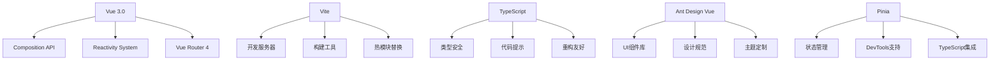

# Vue-Vben-Admin 项目架构分析报告

## 1. 项目概述

Vue-Vben-Admin 是一个基于 Vue 3.0、Vite、Ant Design Vue 的中后台前端解决方案，提供了开箱即用的中后台前端解决方案。本报告对其技术架构、目录结构、核心模块、设计模式和开发流程进行深入分析。

### 1.1 项目背景

Vue-Vben-Admin 致力于为开发者提供一套现代化、高性能、易扩展的中后台前端架构，采用最新的前端技术栈，集成了丰富的企业级功能模块。

### 1.2 技术栈概览



### 1.3 核心技术选型

#### 1.3.1 前端框架
- **Vue 3.0**: 采用最新的 Vue 3 Composition API，提供更好的逻辑复用和类型推断
- **TypeScript**: 全面采用 TypeScript，提供类型安全和开发体验
- **Vite**: 作为开发服务器和构建工具，提供极快的冷启动和热更新

#### 1.3.2 状态管理
- **Pinia**: 新一代状态管理库，替代 Vuex，提供更好的 TypeScript 支持
- **VueUse**: 实用的 Composition API 工具集，提升开发效率

#### 1.3.3 UI 框架
- **Ant Design Vue**: 企业级 UI 组件库，提供丰富的组件和设计规范

#### 1.3.4 工程化
- **Vite**: 现代化构建工具
- **ESLint + Prettier**: 代码质量和格式化
- **Husky + lint-staged**: Git hooks 自动化检查
- **Commitizen**: 规范化提交信息

#### 1.3.5 测试框架
- **Vitest**: 基于 Vite 的单元测试框架
- **Cypress**: E2E 测试框架
- **Testing Library**: 组件测试工具

---

## 2. 目录结构说明

### 2.1 顶层目录结构

```
vue-vben-admin/
├── build/                    # 构建配置
├── mock/                     # Mock 数据
├── public/                   # 静态资源
├── src/                      # 源代码
├── tests/                    # 测试文件
├── types/                    # 全局类型定义
├── .env.*                    # 环境变量配置
├── index.html               # HTML 模板
├── package.json             # 项目依赖
├── tsconfig.json            # TypeScript 配置
├── vite.config.ts           # Vite 配置
└── README.md               # 项目说明
```

### 2.2 源代码目录结构

```
src/
├── api/                     # API 接口定义
├── assets/                  # 静态资源
├── components/              # 通用组件
├── design/                  # 样式相关
├── directives/              # 自定义指令
├── enums/                   # 枚举定义
├── hooks/                   # Composition Hooks
├── layouts/                 # 布局组件
├── locales/                 # 国际化
├── logics/                  # 业务逻辑
├── router/                  # 路由配置
├── settings/                # 应用设置
├── store/                   # 状态管理
├── utils/                   # 工具函数
├── views/                   # 页面组件
├── App.vue                  #